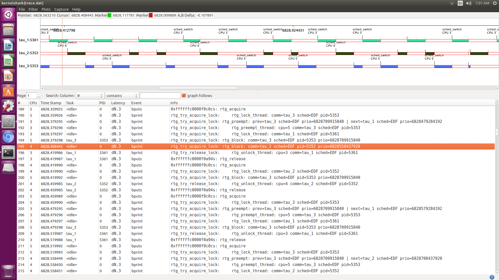

# RT-Gang Demonstration with SCHED\_DEADLINE

### Experiment-1: Understanding EDF in Linux
The first example demonstrates unicore EDF scheduling in vanilla Linux v4.4 kernel. The threads have the following parameters:

| Serial | Thread             | Runtime | Period (Deadline) | 
| :----- | :----------------- |:--------|:----------------- |
| 1      | test_deadline-5138 | 40      | 100               |
| 2      | test_deadline-5139 | 40      | 150               |
| 3      | test_deadline-5140 | 100     | 350               |

All three threads are affined to CPU-3 using cgroup.
In this taskset, Thread-1 preempts Thread-2 whenever its execution coincides with Thread-2. Similarly, both these threads preempt Thread-3 because of the EDF scheduling. This can be verified from the following kernelshark timeline.


In order to verify the correctness of RT-Gang, the same taskset is used. However, instead of creating 3 threads affined to a single core, 3 separate processes (```tau_1 = test_deadline-5138 | tau_2 = test_deadline-5139 | tau_3 = test_deadline-5140```) are created which are affined to different cores. Since RT-Gang allows execution of a single process (i.e., gang) at any given time, this example should produce the same timeline as observed in previous case with threads.



It can be seen that the execution trace under RT-Gang closely matches that in the original example. Slight differences are there because of asynchronous release of threads / tasks in the two cases. Discarding such differences, RT-Gang appears to be doing its job correctly with EDF tasks.

### Experiment-2: Gang Preemption with EDF tasks
For this example, two dual-threaded bandwidth-rt tasks are released simultaneously. The tasks are configured under SCHED_DEADLINE with the following parameters:

| Serial | Tasks | Runtime | Period (Deadline) | 
| :----- | :---- |:--------|:----------------- |
| 1      | tau_1 | 40      | 100               |
| 2      | tau_2 | 20      | 50                |

5 jobs of both tasks are executed and their execution trace is recorded. Under EDF scheduling of RT-Gang, tau_2 should preempt all threads of tau_1 whenever the execution of the two tasks coincides. This can be seen in the following execution trace:


