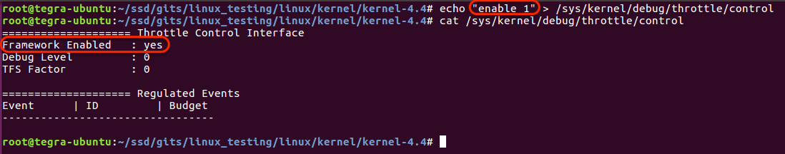
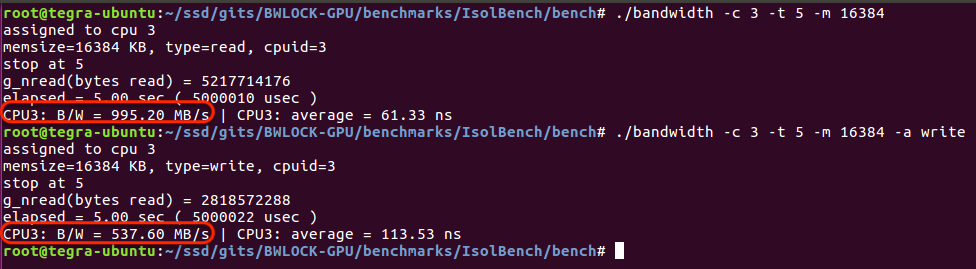
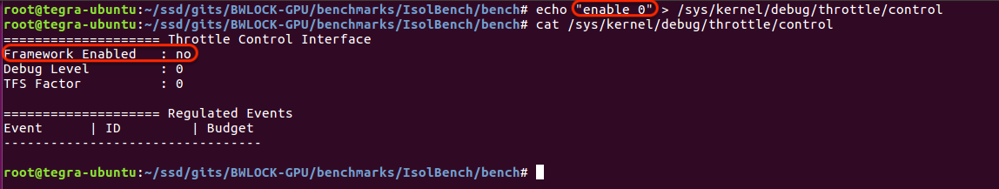

# Demonstration of Throttling (Integrated into Kernel Scheduler)

This document describes the new throttling framework integrated into the Linux kernel scheduler.

## Kernel Configuration
In order to use the throttling framework, following should be done at kernel build-time:
  - Enable ```CONFIG_SCHED_THROTTLE```
  
## Runtime Setup
The throttling framework provides an interface through the debugfs for runtime management of throttling events. The interface can be accesses via ```/sys/kernel/debug/thrttole/control```.

### Enable Throttling


### Regulate Events
The following command-line should be used to regulate an event:
```
$ echo "regulate <regester_id> <budget>" > /sys/kernel/debug/throttle/control
```
where regester_id is the hex value of the event register that needs to be regulated and budget is the regulated value of the event which will trigger an overflow and subsequent throttling of offending best-efforts tasks inside the kernel.

In the figure below, two events are regulated for ARMv8 architecture. ```0x17``` refers to the LLC miss event (including both read and write traffic) which is configured with a budget of ```16384``` events. This translates into a memory bandwidth of ```~1000 MB/sec```. ```0x18``` refers to the LLC write miss event which is configured with a budget of ```8192 = 500 MB/sec``` events.


With this regulation in place, the memory traffic of best-effort applications is limited to ```1000 MB/sec``` for read-only traffic and ```500 MB/sec``` for write traffic.


### Release Events
A regulated event can be released at runtime via the following command-line:
```
$ echo "release <regester_id>" > /sys/kernel/debug/throttle/control
```
Continuing from the previous example, the following figure shows release of the write-regulation event (```0x18```) which removes the ```500 MB/sec``` limit on write traffic.


 This leaves only the ```1000 MB/sec``` read traffic limit.


Releasing the read event removes all regulation.


This lets the best-effort application execute without any limits:


Once all the regulated events are released, the HR-Timer tick is stopped to avoid overhead of the timer interrupt processing.

### Disable Framework

